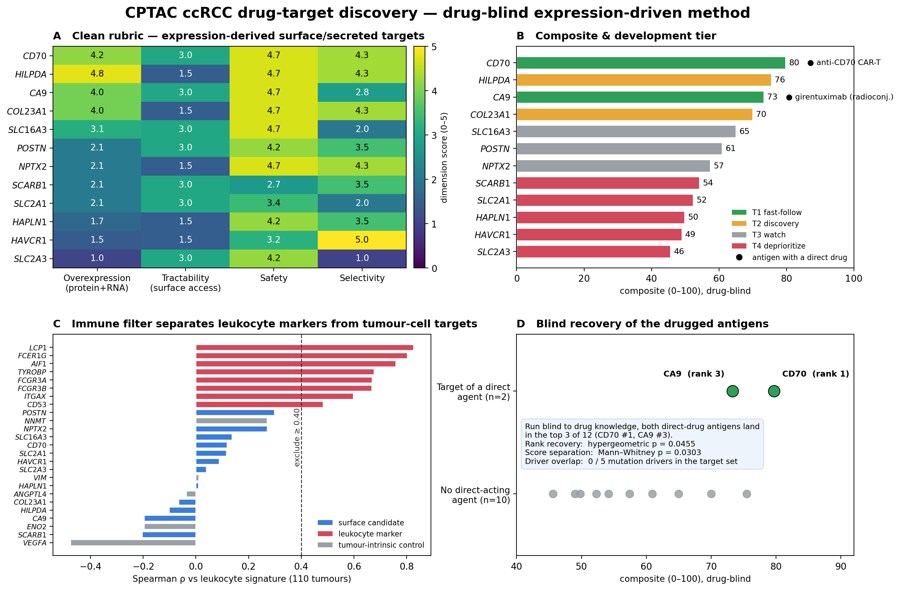
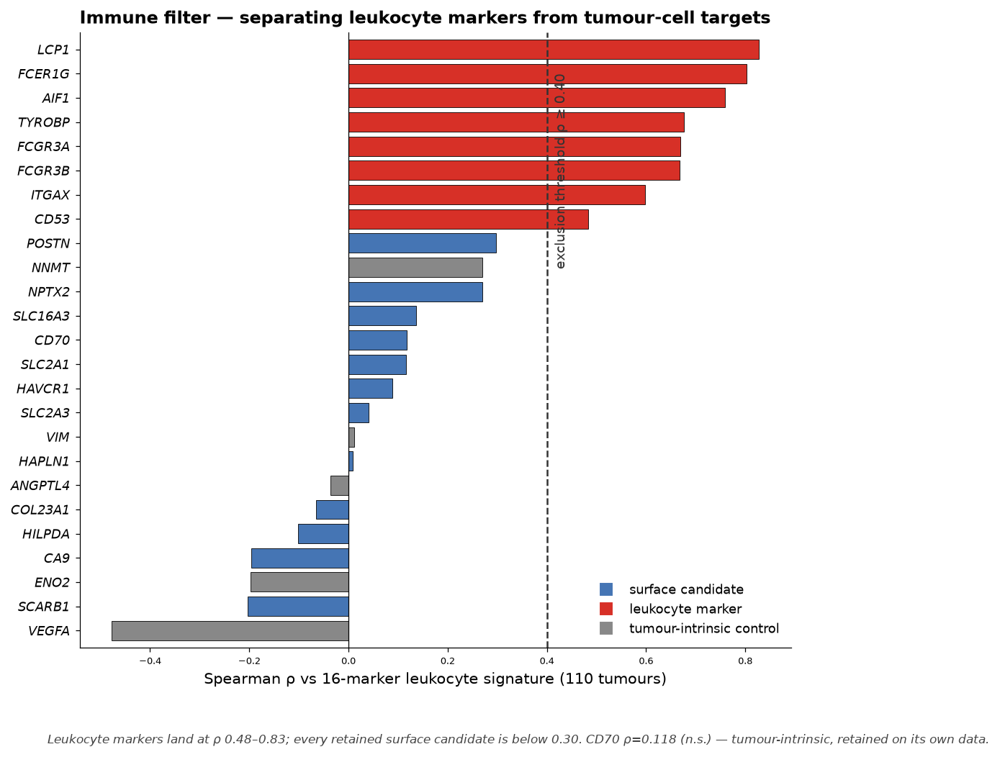
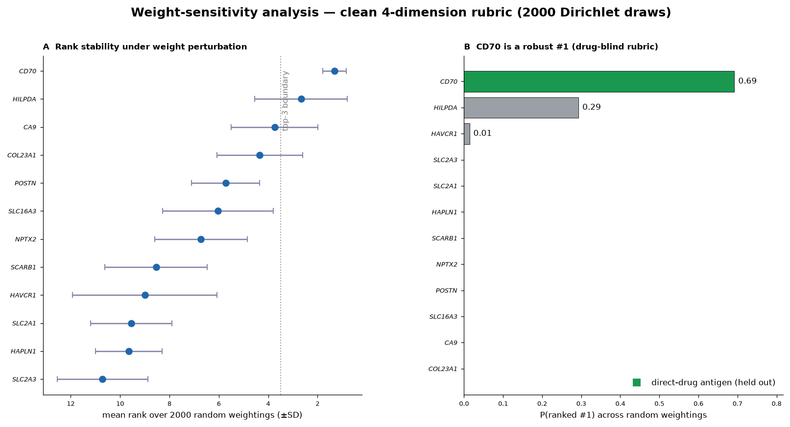

# Drug-Target Discovery — Clear Cell Renal Cell Carcinoma (CPTAC)

A reproducible, **drug-blind, expression-driven** discovery method for surface/secreted drug
targets in **clear cell renal cell carcinoma (ccRCC)**, run on CPTAC proteogenomics
(Clark DJ *et al.*, *Cell* 2019, [DOI:10.1016/j.cell.2019.10.007](https://doi.org/10.1016/j.cell.2019.10.007)).

The method scores candidates using only the CPTAC expression data and public gene-level
annotation — **no drug or clinical-trial information enters selection or scoring**. Drug status
is revealed only afterwards, to test what the blind ranking recovered.

### How it works, in plain terms

1. **Find what the tumour over-produces** — genes with much higher protein in tumour than normal
   kidney, where the RNA agrees.
2. **Keep only drug-reachable ones** — proteins on the cell surface or secreted (what an antibody,
   ADC, CAR-T or radioligand can physically bind).
3. **Remove immune-cell decoys** — "tumour-high" genes that are really markers of infiltrating
   immune cells, detected from the data itself.
4. **Score the survivors** 0–5 on four qualities — overexpression, tractability, safety,
   selectivity — from public databases (UniProt, DepMap, gnomAD, HPA).
5. **Combine into one 0–100 composite** by fixed weights, and rank.
6. **Cross-reference to clinical-trial data at the very end** to ask which top hits are already
   drugged or in trials.

The candidate list narrows like this (full detail in [`docs/methods.md`](docs/methods.md)):

```
11,710 proteins measured
   → 364  protein-overexpressed (log2FC ≥ 1, FDR < 0.05)
   → 310  + RNA-concordant           (candidate pool)
   → 101  + surface/secreted         (drug-reachable)
   →  12  + immune-decoy filter, top 12 by fold-change   ← the scored list (n = 12)
```

> **▶ [View the live interactive report](https://YaaOppong.github.io/ccrcc-target-triage/)** —
> sortable scorecard with live weight sliders, per-gene evidence, the blind-recovery test, the
> immune filter, mutation-driver context, and the full write-up and methods, all in the browser.
> (Or open [`index.html`](index.html) locally.) 

---

## The result in one figure



Run blind to drug knowledge, the method ranks 12 surface/secreted candidates. When drug status is
revealed, **the two ccRCC antigens with a direct therapeutic — CA9 and CD70 — both land in the
top 3 of 12** (CD70 #1, CA9 #3):

- **Rank recovery:** both direct-drug antigens in the top 3 → hypergeometric **p = 0.0455**.
- **Score separation:** direct-drug antigens score higher than the rest → one-sided
  Mann–Whitney **p = 0.0303**.

The method recovers targets already in clinical development without being told what is drugged.

---

## Ranked scorecard (drug-blind composite)

Composite = weighted mean of four dimensions, rescaled 0–100.
**Weights:** association 0.333 · tractability 0.278 · safety 0.222 · selectivity 0.167.

| Rank | Gene | Composite | Assoc | Tract | Safety | Select | Tier | Direct drug |
|---:|------|---:|---:|---:|---:|---:|------|------|
| 1 | **CD70** | 79.7 | 4.2 | 3.0 | 4.7 | 4.3 | T1 fast-follow | anti-CD70 CAR-T (ALLO-316) |
| 2 | HILPDA | 75.5 | 4.8 | 1.5 | 4.7 | 4.3 | T2 discovery | — |
| 3 | **CA9** | 73.3 | 4.0 | 3.0 | 4.7 | 2.8 | T1 fast-follow | girentuximab radioconjugate |
| 4 | COL23A1 | 70.0 | 4.0 | 1.5 | 4.7 | 4.3 | T2 discovery | — |
| 5 | SLC16A3 (MCT4) | 65.0 | 3.1 | 3.0 | 4.7 | 2.0 | T3 watch | — |
| 6 | POSTN | 60.9 | 2.1 | 3.0 | 4.2 | 3.5 | T3 watch | — |
| 7 | NPTX2 | 57.4 | 2.1 | 1.5 | 4.7 | 4.3 | T3 watch | — |
| 8 | SCARB1 | 54.2 | 2.1 | 3.0 | 2.7 | 3.5 | T4 deprioritise | — |
| 9 | SLC2A1 (GLUT1) | 52.3 | 2.1 | 3.0 | 3.4 | 2.0 | T4 deprioritise | — |
| 10 | HAPLN1 | 49.8 | 1.7 | 1.5 | 4.2 | 3.5 | T4 deprioritise | — |
| 11 | HAVCR1 (KIM-1) | 49.0 | 1.5 | 1.5 | 3.2 | 5.0 | T4 deprioritise | — |
| 12 | SLC2A3 (GLUT3) | 45.6 | 1.0 | 3.0 | 4.2 | 1.0 | T4 deprioritise | — |

---

## Method in brief

1. **Overexpression (protein-primary):** tumour-vs-normal protein log2FC ≥ 1, BH-FDR < 0.05.
2. **RNA concordance:** directional corroboration (RNA log2FC > 0).
3. **Surface/secreted restriction:** UniProt localisation — antibody/ADC/CAR/radioligand-accessible.
4. **Immune filter (data-driven):** exclude genes correlated with a 16-marker leukocyte signature
   (Spearman ρ ≥ 0.40 across 110 tumours). Leukocyte markers land at ρ 0.48–0.83; every retained
   candidate is below 0.30. No hand-curated blocklist.
5. **Four-dimension rubric:** overexpression, tractability, safety, selectivity — **all computed
   from expression + gene-level annotation, none from drug/trial data.**

See [`methods.md`](methods.md) for full definitions.

---

## What the immune filter does



The main false-positive mode in bulk-tumour overexpression screens is that "tumour-up" genes are
markers of infiltrating leukocytes. The filter separates these from tumour-cell surface targets
directly from the expression data.

---

## Mutation drivers — context (unscored)

| Driver | Freq | Consequence | Adjacent clinical approach |
|---|---:|---|---|
| VHL | 85 % | HIF-2α/VEGF axis stabilised | HIF-2α inhibitor (belzutifan) |
| PBRM1 | 40 % | SWI/SNF chromatin remodelling | — (IO-response association) |
| SETD2 | 12 % | H3K36me3 loss | WEE1 inhibitor (synthetic lethal) |
| BAP1 | 10 % | nuclear deubiquitinase loss | PARP inhibitor (synthetic lethal) |
| KDM5C | 7 % | H3K4 demethylase loss | — |

**0 of 5 drivers appear in the expression-derived surface/secreted set.** ccRCC's genetic drivers
are loss-of-function tumour suppressors — not directly druggable as surface antigens — so the
expression method and the mutation landscape point at disjoint, complementary target spaces.

---

## Robustness & caveats



- **Weight sensitivity:** across 2000 random weightings, **CD70 is a robust #1** (P(rank 1) = 0.69).
  The interactive report has live weight sliders to re-rank under your own priorities.
- **HILPDA (#2)** ranks high on overexpression but its dominant biology is intracellular
  lipid-droplet regulation; its surface-drug tractability is genuinely low (already reflected at
  1.5). Treat as a biology lead, not a ready antigen.
- **Novelty is not scored** — it is a property of the drug landscape (held out). Discussed
  qualitatively in [`results.md`](results.md).
- **The recovery test is a soft check, not proof.** It asks whether the drug-blind top hits already
  have a direct-acting agent in the clinic - the "anchors" being CA9 (¹⁷⁷Lu-girentuximab, Phase 1/2)
  and CD70 (ALLO-316 CAR-T, Phase 1). **Both are investigational, not approved ccRCC therapeutics.**
  A drug reaching trials is not evidence it *works*; these are small, early-phase studies (~100–120
  patients each); and on a 12-gene list the recovery p-values (0.03–0.05) are borderline. Nothing
  here is clinical guidance.

---

## Repository contents

| File | Description |
|------|-------------|
| [`index.html`](index.html) | **Interactive report** — scorecard with live weight sliders, evidence, figures, recovery test |
| [`results/scorecards/scorecard_clean.csv`](results/scorecards/scorecard_clean.csv) | 12-gene drug-blind scorecard: 4 dimensions + evidence + tiers |
| [`results/scorecards/recovery_stats.json`](results/scorecards/recovery_stats.json) | Blind-recovery statistics (hypergeometric, Mann–Whitney) |
| [`results/scorecards/drivers_context.csv`](results/scorecards/drivers_context.csv) | Unscored mutation-driver context panel |
| [`results/enrichment/immune_filter.csv`](results/enrichment/immune_filter.csv) | Per-gene immune-signature correlations |
| [`results/enrichment/weight_sensitivity.csv`](results/enrichment/weight_sensitivity.csv) | Weight-perturbation Monte Carlo |
| [`results/evidence/evidence_detail.json`](results/evidence/evidence_detail.json) | Raw retrieved values + source identifiers per gene |
| [`methods.md`](methods.md) / [`results.md`](results.md) / [`rubric.md`](rubric.md) | Method, results, rubric |
| [`figures/`](figures/) | `triage_scorecard.png`, `immune_filter.png`, `weight_sensitivity.png`, supporting figures |
| [`code/pipeline.py`](code/pipeline.py) | Reproducible pipeline: retrieval → scoring → recovery test |
| [`code/make_figure.py`](code/make_figure.py) | Regenerates `figures/triage_scorecard.png` from the result files |
| [`environment_snapshot.txt`](environment_snapshot.txt) | Conda environment snapshot |

---

## Reproducing

```bash
# Python 3.11; core deps: numpy pandas scipy statsmodels matplotlib
pip install -r requirements.txt
python code/pipeline.py      # retrieval → scoring → recovery statistics
python code/make_figure.py   # rebuild figures/triage_scorecard.png from the results
```

Data sources (all public): CPTAC CCRCC proteome & clinical (Clark et al. 2019); UniProt;
Human Protein Atlas; DepMap; gnomAD. Drug/trial annotation (ClinicalTrials.gov) is used only for
the held-out recovery test.

---

*Scores are a reproducible decision aid derived from public data, not clinical guidance.
Target-development decisions require full experimental validation and expert review.*
