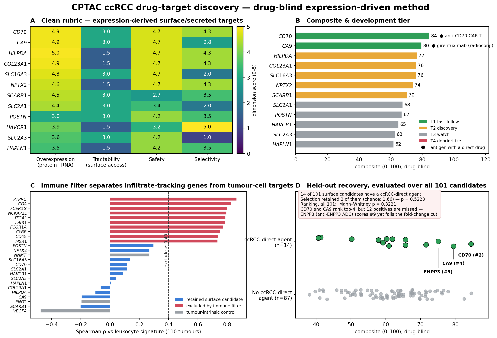
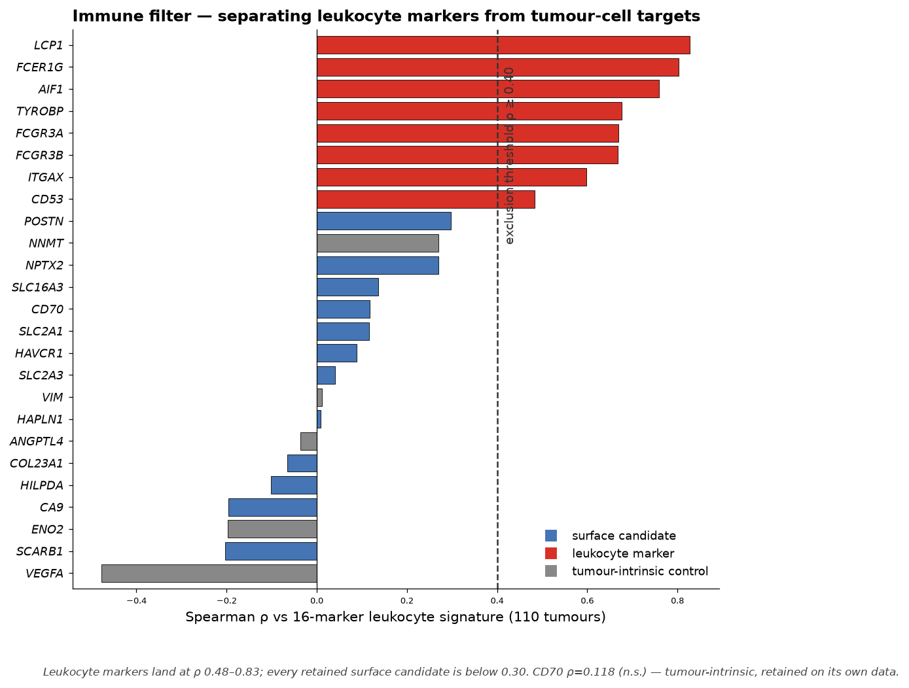
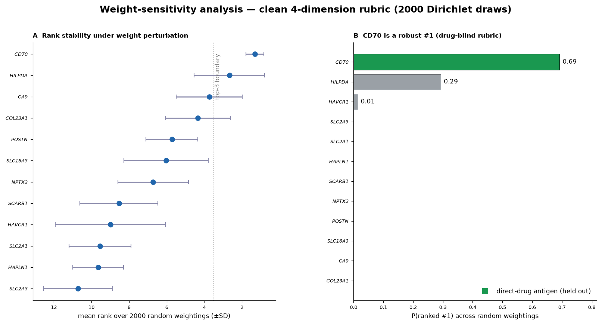

# Drug-Target Discovery — Clear Cell Renal Cell Carcinoma (CPTAC)

A reproducible, **drug-blind, expression-driven** discovery method for surface/secreted drug
targets in **clear cell renal cell carcinoma (ccRCC)**, integrating **multi-omic** CPTAC
proteogenomics — tumour-vs-normal **proteome and transcriptome**
(Clark DJ *et al.*, *Cell* 2019, [DOI:10.1016/j.cell.2019.10.007](https://doi.org/10.1016/j.cell.2019.10.007)).

The method scores candidates using only these CPTAC expression matrices (proteome and
transcriptome) and public gene-level annotation — **no drug or clinical-trial information
enters selection or scoring**. Drug status
is revealed only afterwards, to test what the blind ranking recovered.

### How it works, in plain terms

1. **Find what the tumour over-produces** — genes with much higher protein in tumour than normal
   kidney, where the RNA agrees.
2. **Keep only drug-reachable ones** — proteins on the cell surface or secreted (what an antibody,
   ADC, CAR-T or radioligand can physically bind).
3. **Remove immune-cell decoys** — "tumour-high" genes that are really markers of infiltrating
   immune cells, detected from the data itself.
4. **Score the survivors** 0–5 on four qualities — overexpression, tractability, safety,
   selectivity — from public databases (UniProt, DepMap, gnomAD, HPA).
5. **Combine into one 0–100 composite** by fixed weights, and rank.
6. **Cross-reference to clinical-trial data at the very end** to ask which top hits are already
   drugged or in trials.

The candidate list narrows like this (full detail in [`docs/methods.md`](docs/methods.md)):

```
11,710 proteins measured
   → 364  protein-overexpressed (log2FC ≥ 1, FDR < 0.05)
   → 310  + RNA-concordant           (candidate pool)
   → 101  + surface/secreted         (drug-reachable)   ← all 101 are scored
   →  12  + immune-decoy filter, top 12 by fold-change   ← the shortlist (n = 12)
```

All 101 surface candidates are scored on the same rubric, not just the 12 that survive
selection. That is what makes the selection cascade itself testable — see
[the recovery test](#does-it-recover-known-targets-an-honest-answer).

> **▶ [View the live interactive report](https://YaaOppong.github.io/ccrcc-target-triage/)** —
> sortable scorecard with live weight sliders, per-gene evidence, the blind-recovery test, the
> immune filter, mutation-driver context, and the full write-up and methods, all in the browser.
> (Or open [`index.html`](index.html) locally.) 

---

## The result in one figure



Run blind to drug knowledge, the method scores all 101 surface/secreted candidates and
shortlists 12. When drug status is revealed afterwards, the top of the ranking holds real
antigens: **CD70 (#2), CA9 (#4) and ENPP3 (#9) of 101** are each the target of a direct-acting
agent in renal-cell-carcinoma trials.

How far that generalises — and where the method loses positives — is measured in
[Does it recover known targets?](#does-it-recover-known-targets-an-honest-answer) below.

---

## Ranked scorecard (drug-blind composite)

Composite = weighted mean of four dimensions, rescaled 0–100.
**Weights:** association 0.333 · tractability 0.278 · safety 0.222 · selectivity 0.167.

Association is now a percentile against the full 310-gene concordant pool. Ranking the 12
against themselves re-ranked a list already sorted on that same axis, and compressed a narrow
log2FC band (1.73–2.74) across the whole 0–5 range.

| Rank | Gene | Composite | Assoc | Tract | Safety | Select | Tier | Direct agent |
|---:|------|---:|---:|---:|---:|---:|------|------|
| 1 | **CD70** | 84.5 | 4.89 | 3.0 | 4.7 | 4.3 | T1 fast-follow | anti-CD70 CAR-T (ALLO-316) |
| 2 | **CA9** | 79.5 | 4.89 | 3.0 | 4.7 | 2.8 | T1 fast-follow | girentuximab radioconjugate |
| 3 | HILPDA | 76.6 | 4.96 | 1.5 | 4.7 | 4.3 | T2 discovery | — |
| 4 | COL23A1 | 76.2 | 4.89 | 1.5 | 4.7 | 4.3 | T2 discovery | — |
| 5 | SLC16A3 (MCT4) | 76.0 | 4.76 | 3.0 | 4.7 | 2.0 | T2 discovery | — |
| 6 | NPTX2 | 74.2 | 4.60 | 1.5 | 4.7 | 4.3 | T2 discovery | — |
| 7 | SCARB1 | 70.3 | 4.49 | 3.0 | 2.7 | 3.5 | T2 discovery | — |
| 8 | SLC2A1 (GLUT1) | 67.6 | 4.37 | 3.0 | 3.4 | 2.0 | T3 watch | — |
| 9 | POSTN | 67.1 | 3.01 | 3.0 | 4.2 | 3.5 | T3 watch | — |
| 10 | HAVCR1 (KIM-1) | 65.0 | 3.86 | 1.5 | 3.2 | 5.0 | T3 watch | — |
| 11 | SLC2A3 (GLUT3) | 62.8 | 3.62 | 3.0 | 4.2 | 1.0 | T3 watch | — |
| 12 | HAPLN1 | 61.9 | 3.48 | 1.5 | 4.2 | 3.5 | T3 watch | — |

The full 101-candidate ranking is in
[`results/scorecards/scorecard_101.csv`](results/scorecards/scorecard_101.csv). **ENPP3 ranks #9
there and is absent from this table** — a miss the next section takes apart, and one that is
visible only because the whole 101 is scored.

---

## Does it recover known targets? An honest answer

**Short version: at the very top, yes. As a procedure, not at any level that reaches
significance.** This is a negative result, reported as one — it is not the repo's headline
claim, and it is not buried either.

Applying a fixed rule to all 101 candidates (an agent whose Open Targets mechanism target is
that gene, appearing in a renal-cell-carcinoma trial) yields **14 positives, not 2**. Against
that denominator:

| Question | Test | Result |
|---|---|---|
| Did **selection** concentrate positives into the 12? | hypergeometric over 101 | 2 retained vs 1.66 expected — **p = 0.52** |
| Does the **composite** rank positives above the rest? | Mann–Whitney over 101 | **p = 0.32** |
| Legacy statistic (both within top-2 of 12) | hypergeometric over 12 | p = 0.015 — **conditional; see below** |

**Why the old number was wrong.** The original test permuted only the 12 survivors. Both drugged
antigens had already survived the 11,710 → 364 → 310 → 101 → 12 cascade before the statistic ran,
so it could only ever measure the final ranking step — and a positive discarded anywhere in the
cascade was invisible to it. It is retained in `recovery_stats.json` as
`ranking_given_selection_LEGACY`, explicitly labelled, because it does answer a real question:
*given* the shortlist, is the ordering good? It is not evidence that the shortlist is good.

Note that this conditional statistic got **more** significant under the corrected scoring
(previously p = 0.046 with CD70 #1 and CA9 #3; now p = 0.015 with CD70 #1 and CA9 #2). That is
the point: a number can improve while the claim it supports gets weaker, because the null was
never testing the thing the README was asserting.

**What the fixed test reveals.** 12 of the 14 positives are missed: 2 dropped by the immune
filter (CD4, FCGR3A — correctly, they track infiltrate) and 10 by the top-12 fold-change cut.
The clearest miss is **ENPP3**, which the composite ranks **#9 of 101** and the fold-change
cutoff throws away. The bottleneck is not the scoring — it is selecting the shortlist by a single
input dimension (raw protein fold change) rather than by the composite the rubric produces.

**Caveat on the positive set.** The rule counts MET, EGFR and FLT1 — genuine ccRCC drug targets,
but small-molecule TKI targets rather than surface antigens for ADC/CAR. A strict antigen-only
definition would give a smaller, more favourable denominator. That column
(`curated/clinical_agents.csv → agent_modality`) is deliberately left for curation, because
automated modality lookup is unreliable: ChEMBL returns "Unknown" for MDX-1411 and AGS-16C3F,
both biologics. **The reported statistics do not depend on it.**

---

## Method in brief

1. **Overexpression (protein-primary):** tumour-vs-normal protein log2FC ≥ 1, BH-FDR < 0.05.
2. **RNA concordance:** directional corroboration (RNA log2FC > 0).
3. **Surface/secreted restriction:** UniProt localisation — antibody/ADC/CAR/radioligand-accessible.
4. **Immune filter (data-driven):** exclude genes correlated with a 16-marker leukocyte signature
   (Spearman ρ ≥ 0.40 across 110 tumours). Leukocyte markers land at ρ 0.48–0.83; every retained
   candidate is below 0.30. No hand-curated blocklist.
5. **Four-dimension rubric:** overexpression, tractability, safety, selectivity — **all computed
   from expression + gene-level annotation, none from drug/trial data.**

See [`docs/methods.md`](docs/methods.md) for full definitions.

---

## What the immune filter does



The main false-positive mode in bulk-tumour overexpression screens is that "tumour-up" genes are
markers of infiltrating leukocytes. The filter separates these from tumour-cell surface targets
directly from the expression data.

---

## Mutation drivers — context (unscored)

| Driver | Freq | Consequence | Adjacent clinical approach |
|---|---:|---|---|
| VHL | 85 % | HIF-2α/VEGF axis stabilised | HIF-2α inhibitor (belzutifan) |
| PBRM1 | 40 % | SWI/SNF chromatin remodelling | — (IO-response association) |
| SETD2 | 12 % | H3K36me3 loss | WEE1 inhibitor (synthetic lethal) |
| BAP1 | 10 % | nuclear deubiquitinase loss | PARP inhibitor (synthetic lethal) |
| KDM5C | 7 % | H3K4 demethylase loss | — |

**0 of 5 drivers appear in the expression-derived surface/secreted set.** ccRCC's genetic drivers
are loss-of-function tumour suppressors — not directly druggable as surface antigens — so the
expression method and the mutation landscape point at disjoint, complementary target spaces.

---

## Robustness & caveats



- **Weight sensitivity:** across 2000 random weightings, **CD70 is a robust #1**.
  The interactive report has live weight sliders to re-rank under your own priorities.
- **HILPDA (#3)** ranks high on overexpression but its dominant biology is intracellular
  lipid-droplet regulation; its surface-drug tractability is genuinely low (already reflected at
  1.5). Treat as a biology lead, not a ready antigen.
- **Novelty is not scored** — it is a property of the drug landscape (held out). Discussed
  qualitatively in [`docs/results.md`](docs/results.md).
- **The method does not reach significance on the fixed evaluation** (cascade p = 0.52, ranking
  p = 0.32). CD70, CA9 and ENPP3 at #2/#4/#9 of 101 are a real signal at the very top of the
  ranking, but they do not make the procedure as a whole a validated target-finder. The
  shortlisting rule — top 12 by raw fold change — is the identified bottleneck.
- **A drug reaching trials is not evidence it works.** The anchors are CA9
  (¹⁷⁷Lu-girentuximab, Phase 1/2) and CD70 (ALLO-316 CAR-T, Phase 1) — **both investigational,
  not approved ccRCC therapeutics**, in small early-phase studies (~100–120 patients each).
  Nothing here is clinical guidance.
- **Known next step:** shortlist by composite over the 101 rather than by fold change. That
  recovers ENPP3 and is a defensible change on its own merits, but on the current positive set it
  still does not reach significance (3 of 14 in the top 12, p = 0.22). It is left undone rather
  than quietly adopted, so the fix and its evaluation stay separable.

---

## Repository contents

| File | Description |
|------|-------------|
| [`index.html`](index.html) | **Interactive report** — scorecard with live weight sliders, evidence, figures, recovery test |
| [`results/scorecards/scorecard_clean.csv`](results/scorecards/scorecard_clean.csv) | 12-gene drug-blind scorecard: 4 dimensions + evidence + tiers |
| [`results/scorecards/recovery_stats.json`](results/scorecards/recovery_stats.json) | Held-out recovery: cascade test, ranking test, and the labelled legacy statistic |
| [`results/scorecards/scorecard_101.csv`](results/scorecards/scorecard_101.csv) | **All 101** surface candidates scored on the same rubric |
| [`results/scorecards/surface_candidates_all.csv`](results/scorecards/surface_candidates_all.csv) | The 101 with why each was dropped — audits the 101 → 12 step |
| [`curated/clinical_agents.csv`](curated/clinical_agents.csv) | Held-out positive set for all 101; `agent_modality` is a curated column |
| [`results/scorecards/drivers_context.csv`](results/scorecards/drivers_context.csv) | Unscored mutation-driver context panel |
| [`results/enrichment/immune_filter.csv`](results/enrichment/immune_filter.csv) | Per-gene immune-signature correlations |
| [`results/enrichment/weight_sensitivity.csv`](results/enrichment/weight_sensitivity.csv) | Weight-perturbation Monte Carlo |
| [`results/enrichment/grade_stage_association.csv`](results/enrichment/grade_stage_association.csv) | Abundance vs histologic grade / pathological stage, all 101 |
| [`results/evidence/evidence_detail.json`](results/evidence/evidence_detail.json) | Raw retrieved values + source identifiers per gene |
| [`docs/methods.md`](docs/methods.md) / [`docs/results.md`](docs/results.md) / [`docs/rubric.md`](docs/rubric.md) | Method, results, rubric |
| [`figures/`](figures/) | `triage_scorecard.png`, `immune_filter.png`, `weight_sensitivity.png`, supporting figures |
| [`code/pipeline.py`](code/pipeline.py) | Reproducible pipeline: retrieval → scoring → recovery test |
| [`code/make_figure.py`](code/make_figure.py) | Regenerates `figures/triage_scorecard.png` from the result files |
| [`code/update_report.py`](code/update_report.py) | Regenerates the data embedded in `index.html` from `results/` |
| [`curated/`](curated/) | **Authored / vendored inputs, not generated by the pipeline** — see [`curated/README.md`](curated/README.md) |
| [`environment_snapshot.txt`](environment_snapshot.txt) | Conda environment snapshot |

---

## Reproducing

```bash
# Python 3.11; core deps: numpy pandas scipy statsmodels matplotlib
pip install -r requirements.txt
python code/pipeline.py       # retrieval → scoring → recovery statistics
python code/make_figure.py    # rebuild figures/triage_scorecard.png from the results
python code/update_report.py  # re-embed the results into index.html
```

Runs end to end from a clean checkout. The CPTAC matrices (~80 MB) download to `data/` on first
run, and every API response is memoised under `_cache/`, so re-runs take about 30 seconds and do
not re-hit UniProt, Open Targets, HPA, RCSB or ClinicalTrials.gov. Delete `_cache/` to force a
live refresh; the cascade, the twelve selected genes, and every score reproduce identically
either way.

Data sources (all public): CPTAC CCRCC proteome & clinical (Clark et al. 2019); UniProt;
Human Protein Atlas; DepMap; gnomAD. Drug/trial annotation (ClinicalTrials.gov) is used only for
the held-out recovery test.

---

*Scores are a reproducible decision aid derived from public data, not clinical guidance.
Target-development decisions require full experimental validation and expert review.*
